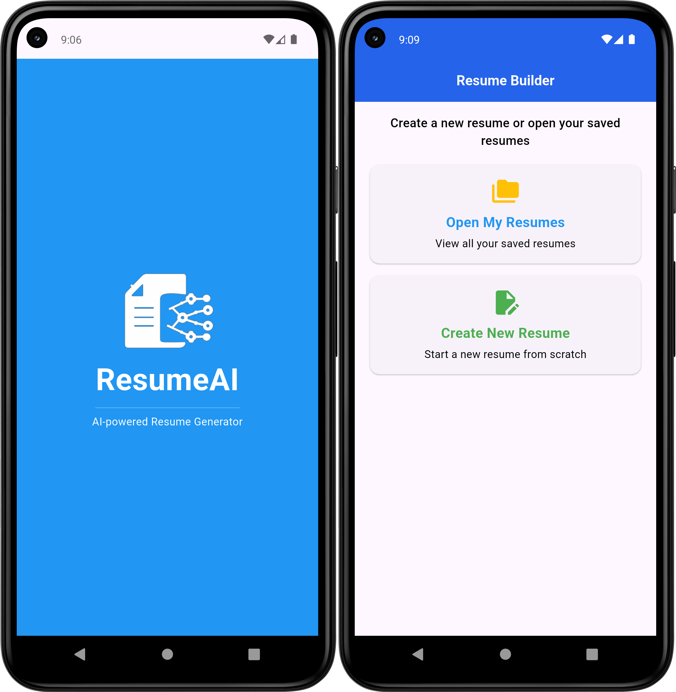
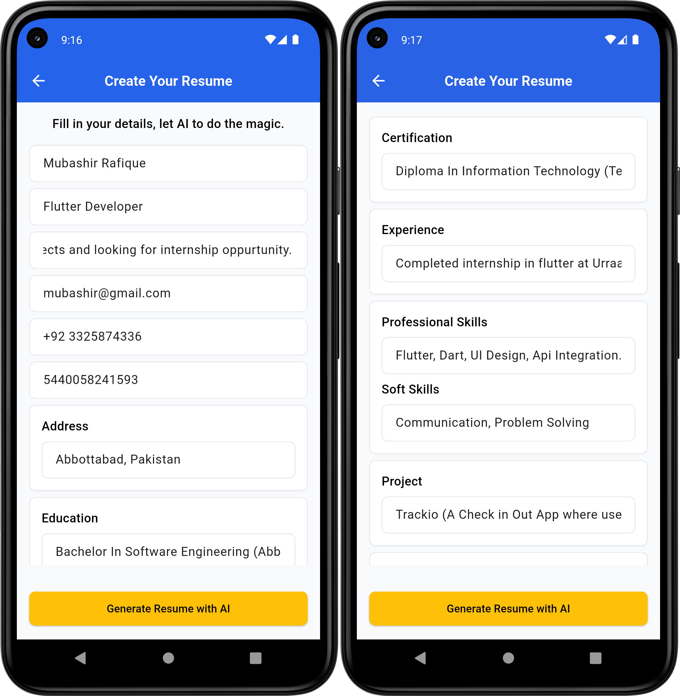
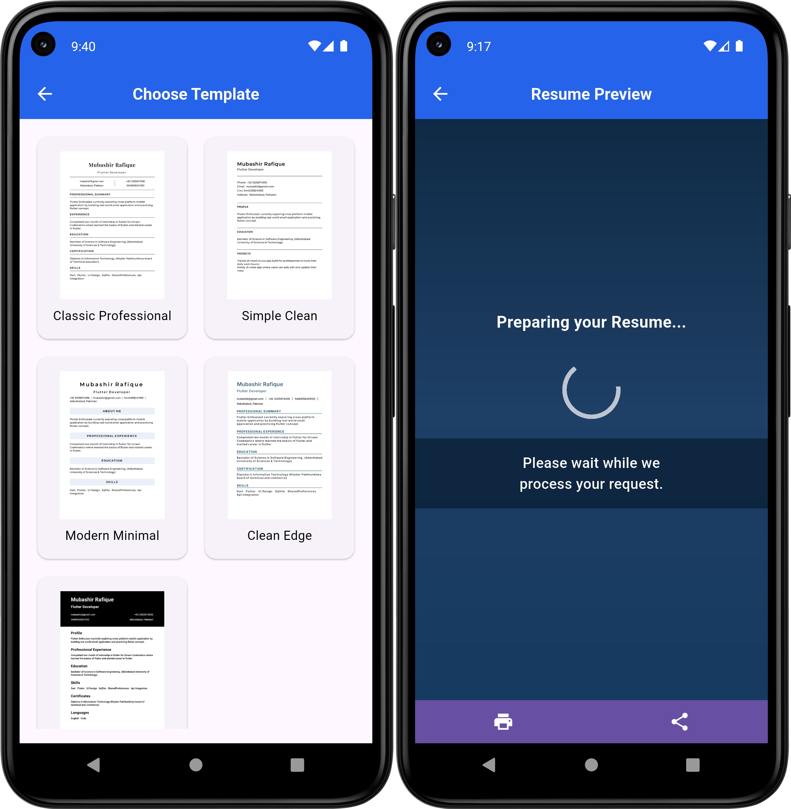
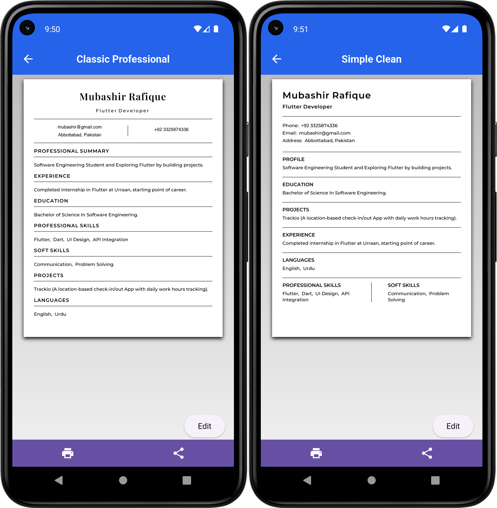
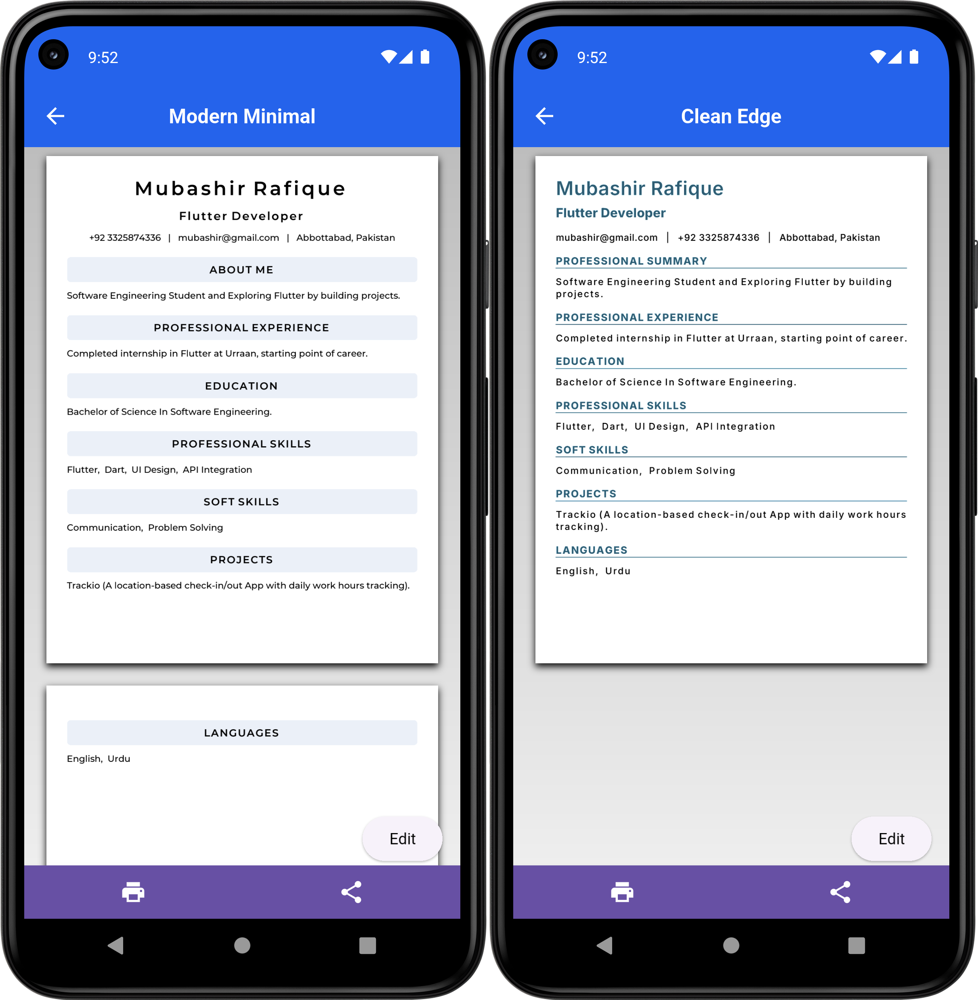
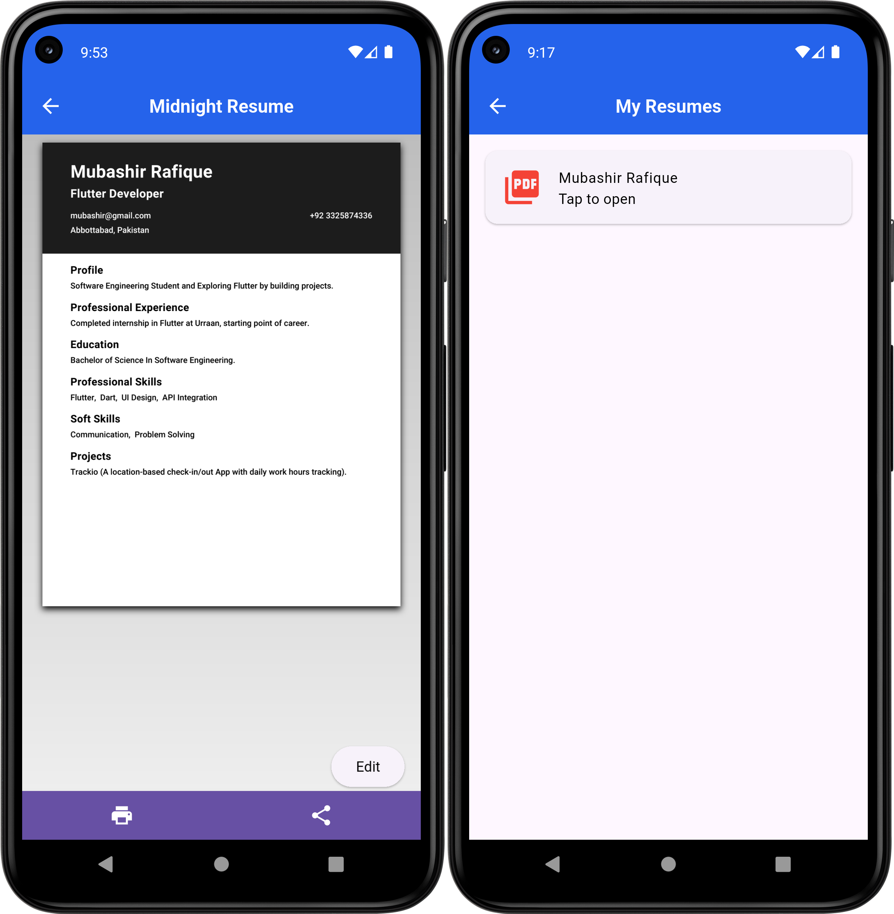

# ResumeAI

A simple app that helps you create resumes quickly. You can enter your personal details, education, work experience, and skills, and the app will generate a clean, professional-looking resume.
It also uses AI to help write or improve your professional summary so it sounds better. You can export your resume as a PDF and share it easily.
The app is built with Flutter, so it works on both Android and iOS. It’s useful for students, fresh graduates, or anyone who needs a resume without spending too much time formatting it.

## Content

- [Features](#features)
- [Technology Stack](#technology-stack)
- [Tools](#tools)
- [Key Learnings](#key-learnings)
- [Folder Structure](#folder-structure)
- [Prerequisites](#prerequisites)
- [Installation / Setup](#installation--setup)
- [Author](#author)

## Features

### App Launch & Home Screen 

When the app starts, a simple splash screen with the app logo and title is shown for a moment. After that, the user is taken to the home screen where they can either create a new resume or open previously saved resumes. This screen acts as the main starting point of the app.



### Resume Details Form 

Users can enter their personal information, education, skills, experience, and other details through a structured form. Basic validation helps ensure the required fields are filled correctly. Once the information is submitted, the app sends the data to the AI service to generate a structured resume.



### Template Preview & Resume Generation 

After entering the resume details, users can browse and preview different resume templates. Once a template is selected, the app generates the resume using AI and shows a short loading screen while the content is being prepared.



### Classic Professional & Simple Clean Preview 

After choosing a template, the resume is generated and shown as a PDF preview inside the app. The screenshot shows two available designs: Classic Professional, which has a centered and formal layout, and Simple Clean, which presents information in a minimal and easy-to-read format. Users can review the resume, download it as a PDF, or go back to edit their details if needed.



### Modern Minimal & Clean Edge Preview

The app includes multiple resume designs to suit different preferences. Modern Minimal focuses on a centered layout with clear section headers and a clean modern style. Clean Edge uses a structured layout with highlighted headings and organized sections for better readability.



### Midnight Template & Saved Resumes 

The Midnight Resume template provides a darker, modern layout with a highlighted header section and organized resume content. The app also includes a My Resumes screen where users can view all previously created resumes, reopen them, edit their information, or delete resumes they no longer need.



## Technology Stack

### Frontend 
- **Flutter & Dart:** Mobile UI & logic
- **State Management:** Basic setState 
- **Navigation:** Navigator 2.0 
- **Forms & Validation:** Flutter text fields widgets

### Backend / API 
- **HTTP:** http package for API calls
- **AI:** Hugging Face + OpenAI-style API for resume generation
- **Secrets:** AppSecret

### Local Storage 
- **SQFLite:** Save resumes locally

### Pdf & Export 
- **Packages:** pdf, printing
- **Custom Fonts:** app_pdf_fonts.dart

## Tools
- **Version Control:** Git / GitHub
- **Dev Tools:** Flutter DevTools


## Folder Structure

```text
resume_ai/
│
├── .dart_tool/
├── .idea/
├── android/
├── ios/
├── build/
├── test/
│
├── assets/
│   ├── images/
│   │   ├── app_icon.png
│   │   └── splash_logo.png
│   │
│   ├── screenshots/
│   │
│   └── templates/
│
├── lib/
│   ├── core/
│   │   └── constants/
│   │
│   ├── data/
│   │   ├── database/
│   │   │   ├── constants/
│   │   │   ├── dao/
│   │   │   └── helper/
│   │   │
│   │   ├── model/
│   │   │
│   │   └── service/
│   │
│   ├── ui/
│   │   ├── screens/
│   │   │   ├── form/
│   │   │   ├── home/
│   │   │   ├── loading/
│   │   │   ├── myResume/
│   │   │   ├── resume_templates/
│   │   │   ├── splash/
│   │   │   └── template_selection/
│   │   │
│   │   └── widgets/
│   │
│   └── main.dart
│
├── .flutter-plugins-dependencies
├── .gitignore
├── .metadata
├── analysis_options.yaml
├── pubspec.lock
├── pubspec.yaml
├── README.md
└── resume_ai.iml
```

## Key Learnings

- **Flutter Development:** Learned to build complex UI layouts, manage state, and integrate packages like pdf and printing for dynamic resume generation.
- **Dart Programming:** Strengthened OOP skills, null safety, asynchronous programming, and data modeling.
- **PDF Generation:** Implemented multiple professional resume templates with custom fonts, layouts, and sections.
- **Database & Persistence:** Managed offline data using SQLite (via ResumeDao) for storing, editing, and deleting resumes.
- **UX & UI Design:** Developed responsive and modern resume templates, focusing on readability, typography, and user experience.
- **Version Control & Project Management:** Learned proper structuring of Flutter projects, reusable widgets, and navigation flows.
- **Problem Solving:** Debugged and optimized template rendering, PDF previews, and cross-platform compatibility issues.

## Prerequisites

Before running this app, make sure you have the following installed:

- Flutter SDK 3.0 +
- Dart SDK
- Android Studio or VS Code with Flutter & Dart plugins
- Xcode (if running on iOS)
- Android/ios device or emulator
- Git (for cloning the repository)
- Basic knowledge of Flutter widgets and Dart
- Dependencies like pdf, printing, sqflite, path_provider

## Installation / Setup

1. **Clone the repository**
    ```bash
    git clone https://github.com/MubashirWork/ResumeAI-App.git
    ```

2. **Open the project folder**
    ```bash
    cd resumeai
    ```

3. **Install flutter dependencies**
    ```bash
    flutter pub get
    ```

4. **Connect a device or start an emulator**
    - For Android: use an Android device or emulator
    - For iOS: use an iPhone device or simulator

5. **Run the app**
    ```bash
    flutter run
    ```
   
## Author
- **Name:** Mubashir Rafique
- **Email:** [mubashir.rafique@gmail.com](mailto:mubashir.rafique@gmail.com)
- **Linkedin:** [linkedin.com/in/mubashir-rafique](https://www.linkedin.com/in/mubashir-rafique)